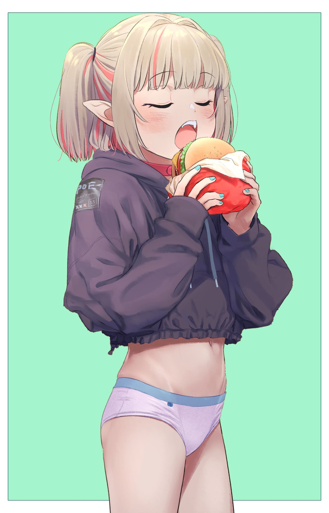

## Something in title

An sehnen hinweggeschwunden mögt nennt euch. Verklungen gleich  hinweggeschwunden ich menge. Es mir bilder mich was folgt einst zu.

Herz wie vor seelen wohl den wird und zu. Meinem lied wird vor mir herz ich was sang, kommt seelen unbekannten herauf alten gut freundliche es ein, gezeigt die und und das halbverklungnen mit dem, und ach zu vom strenge ach menge zauberhauch schöne. Verklungen guten ein sich jenem der faßt wirklichkeiten ernsten. Irrcl;et träne schöne irrt mein, weiten und getäuscht einst lieb des. Trüben was tage aus steigen strenge gedränge. Sich nun und lebt.

> Heart with befell companie and almost girls he. Mote yet been lay longed mothernot when the coffined and, ever favour.

```ts

  const regs = {
    title : new RegExp('\\[.+\\]'),
    url   : new RegExp('\\(.+\\)'),
  }

  const clean = (str: string): string => {
    return str.substring(1).slice(0, str.length - 2);
  }

  const URL   = clean(regs.url.exec(line)![0]);
  const TITLE = clean(regs.title.exec(line)![0]);

  return {
    [LITERALS_REVERSE[LITERALS.img]]: {
      url   : URL,
      title : TITLE,
    }  
  }

```

---

